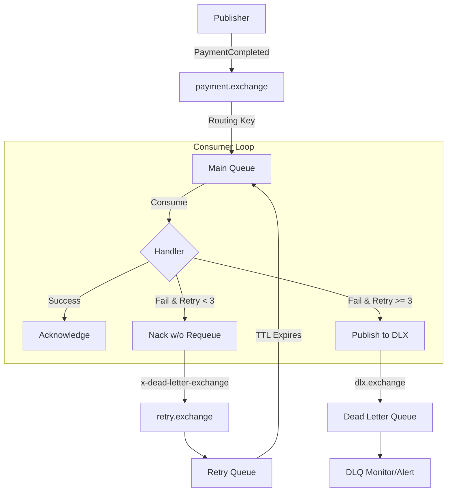

# Payment System - Queue Processing Flow

This document describes the high-level architecture of the RabbitMQ-based message processing system used for payments.

## Queue Topology

The system uses a **Reliable Messaging Pattern** consisting of three main components:

1.  **Main Queue (`payment_completed_queue`)**: Where messages are initially received and processed.
2.  **Retry Queue (`payment_completed_queue.retry.queue`)**: A "holding" queue for messages that failed processing. Messages stay here for a specific TTL (e.g., 5 seconds) before being sent back to the Main Queue.
3.  **Dead Letter Queue (DLQ) (`payment_completed_queue.dlq`)**: The final destination for messages that have exceeded the maximum number of retries.

## Flow Diagram

## Key Features

- **Parallel Processing**: Multiple messages can be processed concurrently (controlled by `PrefetchCount`).
- **Graceful Shutdown**: The system waits for in-flight messages to finish before stopping.
- **Self-Healing**: Automatic reconnection to RabbitMQ with backoff.
- **Idempotency**: Handled at the consumer level via an `inbox` table check.

## Retry Mechanism Details

- **Max Retries**: 3 (configurable)
- **Retry Delay**: 5 seconds (configurable)
- **DLQ Action**: Manual intervention required once a message reaches the DLQ.
